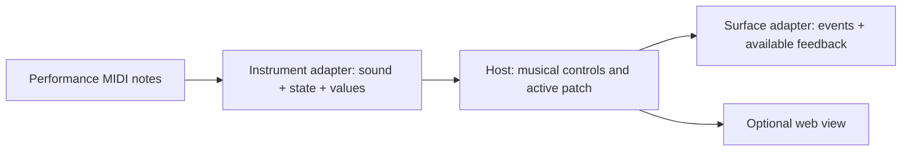

# Musical controls belong between instruments and control surfaces

**Status:** DESIGN, 2026-09-29. The portable integration is proposed, not built.

> **In short.** An instrument describes what a player can change and what
> state actually resulted; a surface describes what it can sense and show.
> Polyclav binds the two without teaching either one the other's protocol.

**Why it matters.** A hardcoded parameter-to-MIDI map may work for one plugin
and one keyboard, but it cannot explain meanings, handle missing controls, or
move to a smaller surface without rewriting instrument logic.

**The shape.** Instrument adapter → musical controls → patch-aware host
assignments → surface adapter. Audio and playing notes remain independent of
optional panel feedback.

**Cost.** A host-owned assignment layer and explicit ownership/feedback rules.
No plugin or controller must implement a proprietary extension just to play.

**Start at [the portable boundary](#2-the-portable-boundary)** — it defines what
each developer must supply and what remains a host choice.

**Needs your ruling:** [OQ-1](#OQ-1), [OQ-2](#OQ-2).

**Reads with:** [developer handoff](../INSTRUMENT_SURFACE_HANDOFF.md) (a
self-contained brief to give an instrument or controller developer),
[configurability notes](../CONFIGURABILITY.md) (the existing surface seam),
[hardware checks](../HARDWARE_TESTS.md) (the Launchkey example's observed bytes).

---

## 1. Goal and non-goals

Given a playable instrument and a controller, a player should be able to
select a sound, locate its important actions, edit it with predictable
feedback, switch sounds, and return to the saved result. A second controller
with fewer encoders, no faders, or no screen should retain the *same musical
meaning*, even if it uses a different gesture or shows fewer values.

This design does **not** require CLAP, an LCD, RGB LEDs, a fixed number of
faders, a particular plugin, or a Novation layout. It does not make arbitrary
plugin parameters musically self-describing. It does not promise state recall
for an instrument without a state or parameter-restore facility, nor a
screen readback when the instrument cannot report its resulting value. It
does not authorize rewriting a user's device-local Custom modes.

## 2. The portable boundary

**Musical control** *(coined here)* is a stable, instrument-specific intent
such as `filter.cutoff`, `organ.drawbar.16ft`, or `amp.attack`, with
range, behavior, applicability, and a human-readable result. It is **not**
a MIDI CC, plugin enumeration position, or hardware coordinate. A backend
adapter translates it to a native synth setting, plugin parameter, or
explicit MIDI/OSC message where such a target exists.

**Surface capability** *(coined here)* is a physical input or output the host
can actually use — for example, an absolute fader, a relative encoder, a
press/release button, a one-line text display, or an RGB pad. It does **not**
assert that the device has a particular manufacturer's mode or sends a
particular channel number. The surface adapter owns raw bytes and announces
only verified capabilities.

| Party | Owns | Must not assume |
|---|---|---|
| Instrument/backend developer | Stable target identity, actual parameter behavior, availability, optional state and result reporting. Can provide a semantic profile when native metadata does not express musical intent. | That every host has nine faders, an LCD, or the same plugin format. |
| Surface developer | Control events (turn, absolute move, press/release), physical capacity, feedback operations and device connection state. | That `CC 5` means drawbar 1, or that a plugin can show colors. |
| Host/integrator | Active patch, assignments, one destination per gesture, page state, conflict policy, errors and feedback presentation. | That a readable parameter name is unique or that sending a command means the device/instrument applied it. |

The instrument's **reported value is authoritative**. A host write may be
shown as pending if the backend reports results asynchronously. If it cannot
report them, the host labels the display as a requested value rather than a
confirmed one. Hardware feedback never creates a second source of truth.

### 2.1 What an instrument developer can provide

The following is a behavioral record, **not a required schema or a new
plugin API**. A standard plugin's IDs, modules, flags, state and value-to-text
methods can supply much of it; other backends can adapt their own interfaces.
An optional versioned profile describes the musical information a transport
cannot express. A plain plugin without one still plays and can have explicit
user bindings, but does not acquire a fabricated "native" layout.

| Field | Expected behavior |
|---|---|
| Identity | A stable backend target ID plus a musical role within that instrument. Resolve duplicate display names with the backend's real identity and validated module/scope. Never use enumeration order as identity. |
| Shape | Continuous, stepped, enum, momentary, toggle, or read-only; valid range, default, unit, discrete labels and meaningful adjustment step where applicable. |
| Applicability | Which variant/engine/voice or preset makes the control effective; do not assign visible but inactive controls. Explicitly identify controls that change the variant itself. |
| Presentation | Full label, short label for limited displays, result text and suggested musical grouping/priority. Labels may be adapted to hardware; identities do not change. |
| Observability | Initial value after state restore, changes made in the instrument's own UI, and a way to distinguish confirmed state from a host request if available. |
| Persistence | State snapshot/restore if supported, or an explicit declaration that recall is unavailable. State format/version ownership stays with the instrument. |

For an instrument with only MIDI CC support, an **explicit configuration**
can supply identities, ranges and bindings. Unless it also provides readback,
there is no verified current value after a preset or external edit. A host
may display its last *requested* value, labeled as such; it may not silently
claim that the instrument's state was observed.

### 2.2 What a surface developer can provide

A surface profile reports the **number and kinds** of controls, input
semantics (relative tick coding, absolute range, release, touch/pressure),
feedback limits (text length/encoding, colors, brightness), navigation
controls, connection and layout requirements, and whether an absolute
control supports motorization or pickup. Unavailable capabilities are absent,
not dummy outputs. A port name is a hint, not proof of device role; the
owner must test the physical path and visible effects before promising
outbound LED or mode control.

A surface must not reprogram persistent hardware layouts as a shortcut to
host pages. If a controller requires a specific supported layout, restoring
that layout should be explicit and reversible. A read-only inspector for raw
input remains useful even when no writable surface integration is safe.

## 3. Host assignment and conflict rules

A **host page** is a temporary set of assignments over the same physical
controls; it is not a device firmware mode or an instrument preset. The host
holds its active page, patch and feedback state. Proposed default binding
order:

1. Preserve the surface's documented system gestures (patch selection,
   navigation and safety) before placing instrument controls. Their
   reassignment requires an explicit owner decision; see [OQ-2](#OQ-2).
2. Filter controls by the *active, confirmed* instrument variant and
   supported backend targets. Bind named musical groups in declared priority
   order to available inputs. For eight encoders, overflow goes to another
   navigable host page, not an arbitrary truncation that changes meanings.
3. Give one gesture **one destination**. A control assigned to the instrument
   cannot also change an external mixer. Missing/ambiguous target, invalid
   range or missing capability leaves that gesture unavailable and reports
   why; it must not silently fall through to an unrelated destination.
4. Adapt feedback to the device: long labels to short text, color to simple
   on/off, or no on-device feedback with a web view if present. Never invent
   an extra display, motor or physical button. A surface with no page
   navigation needs explicit reduced bindings or another way to navigate;
   the host cannot make hidden controls reachable by assertion.

An instrument profile proposes grouping and priority; a user may override
*assignments* without renaming the instrument's control identity. Backend
parameter values retain backend-native units. Each surface's resolution and
adjustment step are translated at the host boundary, clamped and (when
stepped) quantized before a write. If musical scaling is unknown, leave the
binding explicit/configurable rather than guessing a CC-to-range curve.

## 4. Lifecycle and failure behavior

1. **Request a patch.** Serialize selection with other patch requests.
   Preserve or explicitly release held notes; save previous state only if
   supported. Mark the new patch loading and disable assignments that might
   reach the previous instance. No gesture intended for the new patch may
   be sent to the old one.
2. **Confirm the backend.** When the matching load generation reports active,
   query the actual variant and values *after* state restore. Only then
   validate targets and publish one new assignment/feedback snapshot. If a
   requested variant and actual variant disagree, report the mismatch rather
   than routing its controls under the wrong label.
3. **Switch or reconnect a surface.** Repaint from that snapshot, not from
   past sends. If no surface is available, playing notes and instrument audio
   continue when the backend permits; the web may provide controls. A new
   surface inherits no unsupported layout commands.
4. **Handle edits.** Host writes target the current backend generation only;
   backend feedback updates the authoritative value and all present views.
   Coalesce display traffic rather than blocking the audio callback. Discard
   delayed old-generation feedback. When feedback is unavailable, show
   requested/unconfirmed state clearly.
5. **Fail safely.** A failed load leaves old assignments disabled until the
   surviving backend is identified; it does not imply that its audio stopped.
   A missing parameter disables only dependent bindings, reports the problem,
   and never redirects a fader into a mixer. A crash cannot promise a final
   state save; missing state support is visible rather than fabricated.

Absolute controls can disagree with recalled state. Immediate writes, pickup
(waiting until the physical control crosses the current value), and motorized
updates have different feel and hardware requirements. The choice is not
smuggled into a generic mapping algorithm: see [OQ-1](#OQ-1).

## 5. Two worked examples, neither a requirement

Current Polyclav claims in these examples were checked against the code at
`4bbcd83` on 2026-09-29. Binary discovery is a snapshot, not a future
compatibility guarantee.

### 5.1 CLAP instrument: Potato Keys

On 2026-09-29, a local Linux build of `com.littlepotato.keys` exposed 40
CLAP parameters. Nine Drawbars have a 0–8 range; Expression is 0–100,
Rotary 0–3, and Engine 0–2. `Drive`, `Tone` and `Output Level` are repeated
names in separate modules. Earlier exploration suggests Organ/Tine/Reed for
Engine 0/1/2, but the plugin developer must confirm the meanings and which
controls apply to each engine. One plugin ID can back several named patches
with distinct saved state; a new patch without a seed starts at the plugin's
default **Organ**, regardless of its name. This is an *example* of variant
validation and state initialization, not a rule that every instrument has
three engines or must implement CLAP.

Today's Polyclav Organ integration matches nine footage names, owns all nine
faders only for an explicitly opted-in Organ patch, and otherwise leaves
mixer routing alone; expression and Leslie gestures are also opt-ins.
Tine/Reed should not inherit these rules just because the plugin exposes
all parameters. See [current behavior](../USER_GUIDE.md#launchkey-organ-drawbars),
[Organ fader routing](../../cmd/polyclav/organ_fader_router.go) and
[CLAP state selection](../../internal/controls/controls.go#L1630-L1710).

### 5.2 Control surface: Launchkey MK4 61

The Launchkey has a performance MIDI port and a DAW control port. Polyclav
supports DAW pads, Plugin encoders in relative output, and Volume faders;
by default it restores these layouts after user changes. The top eight pads
select patches (with bank navigation); bottom pads indicate host knob pages.
The current page state machine has five native-synth pages but restricts
non-native patches to MAIN: **plugin pages are not built**. The keyboard
can present eight encoders, nine faders and buttons, 16 RGB pads and two
ASCII display lines of up to 16 bytes, with a current host popup lasting
800 ms. Those are surface capacities, not instrument parameters. Its
button/pad reports, colored feedback and layout restoration have been
observed or tested separately; see [hardware checks](../HARDWARE_TESTS.md),
[driver](../../internal/launchkey/driver/driver.go), and
[page state](../../internal/controls/pages/pages.go). Do not translate
existing Track-bank or page-navigation gestures into silent engine switches.

## 6. Alternatives and what proves the design

| Alternative | Verdict |
|---|---|
| Hardcode one plugin's numeric IDs in a controller driver | Reject: instrument changes require device-driver edits and duplicate parameter names stay ambiguous. |
| Demand every plugin implement a proprietary descriptor | Reject: explicit bindings and generic metadata must remain a usable fallback; semantic richness is opt-in. |
| Program each surface's permanent Custom mode for every sound | Reject as the default: it changes user-owned hardware setup and complicates recovery. |
| Enumerate all parameters in plugin order as the advertised "native" UI | Reject: playable but not meaningfully organized. An explicitly labeled generic parameter browser is different. |
| Use musical roles plus backend and surface adapters | Preferred pending rulings below. Supports rich and limited devices without pretending their feedback is equivalent. |

**Acceptance across three distinct combinations:** a self-describing
instrument on a capable surface, that instrument on a smaller surface, and
a second instrument with different backend semantics on the capable surface.
In each, patch switching must preserve only supported state, keep navigation
reachable, avoid duplicate destinations and stale feedback, and label
unconfirmed values. Run synthetic mapping and failure tests, then verify
actual audio, mode changes, fader behavior and visible output on available
hardware. A simulated MIDI send alone does not prove the device responded.

## 7. Open questions

1. 💬 **OQ-1: What is the default takeover rule for absolute controls after
   recalled state differs from hardware position?** It determines whether
   the next small move jumps an instrument parameter. The host can offer
   role-specific overrides when an instrument values immediacy over safety.

   - **A — Immediate.** Most responsive for drawbars; may jump preset tone.
   - **B — Pickup.** Avoids jumps; can feel inert without a direction cue.
   - **C — Role-specific.** Default pickup for recalled controls, with
     explicit immediate roles and direction feedback where possible.

   <!-- vantage: oq id=OQ-1 leaning="Role-specific — default to pickup on recalled values, permit explicit immediate performance controls." -->

   _Leaning:_ C: pickup on recalled values, explicit immediate roles.

   **Answer:**
   > _(empty — fill in when decided)_

2. 💬 **OQ-2: Who may reassign a surface's established system controls?**
   Changing patch/page navigation or familiar performance buttons can break
   existing muscle memory. The Launchkey's Organ color buttons are one
   example, not the rule for all controllers.

   - **A — Owner-only opt-in.** Preserve current system/patch gestures by
     default; a user explicitly approves any reassignment.
   - **B — Integration profile may replace them.** Gives instrument authors
     more surface area, but installing a profile can change controls without
     a user's decision.

   <!-- vantage: oq id=OQ-2 leaning="Owner-only opt-in — no instrument profile silently steals patch navigation or existing surface gestures." -->

   _Leaning:_ A: explicit owner choice for established gestures.

   **Answer:**
   > _(empty — fill in when decided)_

The [developer handoff](../INSTRUMENT_SURFACE_HANDOFF.md) requests examples
from instrument and controller authors to pressure-test these rules. Neither
question prevents a developer from describing their existing capabilities.
