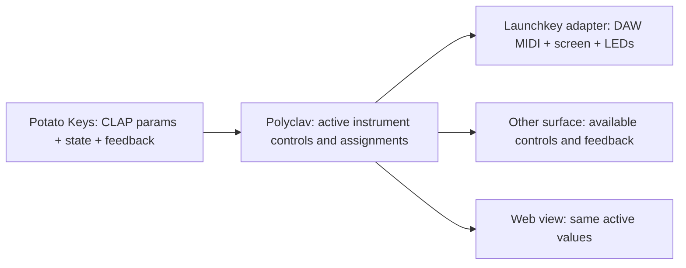

# Potato Keys belongs in an instrument layer, not in a MIDI map

**Status:** DESIGN, 2026-09-29. This integration is proposed, not built.

> **In short.** Let Potato Keys describe musical controls and current state; let
> Polyclav assign those controls to whatever physical surface is present. Keep
> the Launchkey's DAW layout fixed while the host changes its own pages.

**Why it matters.** Today's Organ path works, but it knows footage labels,
Leslie values, and nine specific faders. Copying that path for Tine, Reed, or a
second controller would multiply exceptions rather than make a native-feeling
instrument.

**The shape.** Plugin parameters and state → host-owned instrument controls →
patch-aware assignments → device-specific input and feedback.

**Cost.** An instrument-aware host layer and an explicit ownership policy;
parameter discovery and display alone do not make a finished integration.

**Start at [the proposed boundary](#the-proposed-boundary)** — the ownership
rule and patch-switch sequence determine the rest.

**Needs your ruling:** [OQ-1](#OQ-1), [OQ-2](#OQ-2).

**Reads with:** [Potato Keys agent handoff](../POTATO_KEYS_HANDOFF.md) (a
standalone brief to send to the plugin's agent), [hardware checks](../HARDWARE_TESTS.md)
(observation versus device verification), [user guide](../USER_GUIDE.md#launchkey-organ-drawbars)
(current organ behavior).

---

## Goal and limits

A player should choose Organ, Tine, or Reed as a distinct patch; play without
opening a browser; find the important parameters by feel; see the *resulting*
value on the keyboard; and return to the same sound after switching patches.
A different controller should receive the same musical assignments at its own
capacity, not need to imitate Novation MIDI bytes.

This does **not** propose rewriting Potato Keys' synthesis, taking over its
own user interface, automatically programming Launchkey Custom modes, or
shipping macOS CLAP support by changing a platform guard. It does not claim
that any proposed layout has been tried by a musician. The current release
hosts the Linux plugin; macOS CLAP hosting and an arm64 Potato Keys build are
separate prerequisites for macOS playing.

## What already exists, and what does not

The inventory below was checked against the tree at `4bbcd83` on 2026-09-29;
plugin parameters were discovered from the locally mounted Linux binary on
that date. A plugin binary snapshot is not a promise about future builds.

| Surface | Existing behavior | Boundary to respect |
|---|---|---|
| Keyboard and DAW port | Performance notes/wheels arrive through the selected MIDI input; DAW pads, encoders, faders and transport use a separate port. Supported layouts are DAW pads, Plugin encoders (relative), Volume faders. | [Driver](../../internal/launchkey/driver/driver.go) and [layout recovery](../../internal/launchkey/driver/mode.go); don't commandeer Custom layouts. |
| Host-created pages | Eight encoders use five named synth pages. The top eight pads select patches; the bottom row indicates pages. A non-native patch is restricted to MAIN. | [Page state](../../internal/controls/pages/pages.go); plugin pages are **new work**, not an existing Potato Keys mode. |
| Display and LEDs | The host writes two ASCII lines of up to 16 bytes each, restores the patch name after an 800 ms popup, colors pads, and colors nine fader buttons. | [Screen](../../internal/launchkey/driver/screen.go), [pads](../../internal/launchkey/driver/pads.go), [buttons](../../internal/launchkey/driver/buttons.go); show short names, not an imagined full-screen UI. |
| Organ-only routing | With an explicit organ patch, faders 1–9 bind to unique footage-named CLAP parameters in the 0–8 range; missing/ambiguous labels capture the faders but change nothing, including the OSC mixer. Buttons 1/2 cycle LED schemes, button 9 controls Leslie. | [Faders](../../cmd/polyclav/organ_fader_router.go), [buttons](../../cmd/polyclav/organ_drawbar_leds.go), [pedal](../../cmd/polyclav/organ_pedal_router.go). No equivalent Tine/Reed routing exists. |
| Plugin state and feedback | Per-patch CLAP state is saved at switch/shutdown and restored on selection. The active parameter snapshot is cached; feedback changes update it. Patch loads complete asynchronously. | [State selection](../../internal/controls/controls.go#L1630-L1710), [load status](../../internal/patches/patches.go), [feedback follower](../../cmd/polyclav/main.go#L720-L775); do not address the previous instance after a switch. |
| Developer inspection | A development-only page lists parameter ID, module, name, range, current value and flags; it can write a selected parameter. | [Plugin inspector](../../internal/web/dev_plugin.go#L190-L332). This is not a shipped instrument page or a general mapping editor. |

The currently inspected plugin reports **40 parameters** under ID
`com.littlepotato.keys`: nine Drawbars (0–8), Expression (0–100), Rotary
(0–3), an Engine parameter (0–2), and timbral controls including Touch,
Bark, Bell, Decay, Release, Pickup, Detune, Tremolo, Trem Rate, Drive, Tone,
Width and Output Level. `Drive`, `Tone`, and `Output Level` occur both inside
and outside the Engine module; **name alone is not an identity**. Prior
exploration associates Engine values 0/1/2 with Organ/Tine/Reed; the Potato
Keys agent must confirm that ordering and each control's applicability.

## The proposed boundary

**Instrument control** *(coined here)* means one musically named action or
value, with an identity, unit, valid range, step/enum labels, applicability
by engine, and current value. It is **not** a MIDI CC, a screen coordinate,
or a guess based on the order of parameters returned by a plugin. The CLAP
[parameter and state extensions](https://github.com/free-audio/clap/tree/main/include/clap/ext)
remain the plugin/host transport; any additional semantic descriptors are a
negotiated integration contract, not a proposed replacement for CLAP.

- **Potato Keys owns sound and truth.** It supplies stable parameter IDs,
  unambiguous module/meaning, stepped and textual values where appropriate,
  state save/restore, and change notifications when its own UI changes a
  parameter. The plugin agent should decide what belongs in standard CLAP
  metadata versus a small, versioned instrument profile maintained with the
  plugin; the host must not invent meanings from labels alone.
- **Polyclav owns intent and assignment.** An active patch chooses an engine
  and its controls. Polyclav validates their availability and decides which
  action receives each knob, fader, button or pad. Its OSC mixer, audition
  player and plugin parameter writes must each have one clear owner. The
  host's UI, Launchkey and any other surface observe one active patch.
- **The surface adapter owns device bytes.** It reports logical turns,
  absolute moves, presses and releases and paints only supported feedback.
  A second controller may have no RGB pads, text display or faders; it still
  reaches instrument controls. Device capability changes the presentation,
  not which parameter `organ.drawbar.16ft` means.

**Resolution rule:** bind by plugin-provided stable ID and checked module
plus expected range/meaning. Refuse missing, duplicate or incompatible
controls with visible feedback; do not fall through to a different device
function. An exact-name fallback can keep the existing Organ integration
working while both projects agree on a stronger contract. Do not bind a
Tine/Reed patch to Organ drawbars merely because the plugin exposes all 40
parameters in every engine.

### Minimum instrument-control record

This is a proposed *behavioral contract*, not a new CLAP extension or a
committed file format. The Potato Keys agent should say which fields CLAP
already supplies and which require a plugin-maintained integration profile.

| Field | Needed meaning |
|---|---|
| Identity | Stable CLAP parameter ID **and** musical role (for example, `organ.drawbar.16ft`); module/name are displayed and checked but may change or collide. |
| Availability | Which engine(s) can use it and whether it is continuous, stepped, momentary or read-only; a visible-but-inactive parameter must not be assigned. |
| Value | Min/max, default, current value, step/enum labels and display text with units; no host-guessed enum meaning or name-only matching. |
| Musical grouping | Suggested page, priority and short display label (≤16 ASCII bytes after adaptation); one parameter may appear on more than one host page but has one actual value. |
| Feedback | When the plugin reports a new value, that value wins over any speculative host display; attach it to the active plugin generation before updating surfaces. |

If metadata or the optional profile lacks a required role, leave that
assignment absent and expose the raw CLAP control in the development view.
Group extra controls onto additional host pages; do not displace patch pads
or silently assign a ninth fader to mixer and plugin simultaneously. On a
surface with fewer physical controls, keep the same identity and grouping;
the surface chooses pages or an explicit reduced set, not a new meaning for
the same labeled action. For relative encoders, use the control's declared
step and clamp to its range; without a declared musical step, its scaling is
part of the joint design, not an arbitrary CC-to-range multiplication.

## How it should feel on the Launchkey

These are **candidate assignments for joint design**, not controls already
wired up. The Launchkey stays in DAW pads / Plugin encoders / Volume faders;
"Organ" and "Tone" below are *host-created pages*, not device modes.

| Area | Organ candidate | Tine/Reed candidate | Existing constraint |
|---|---|---|---|
| Nine faders | Nine drawbars, in printed left-to-right footage order; quantize/display actual 0–8 values. | Leave on their prior mixer binding unless an engine-specific assignment is explicitly chosen; never silently borrow Organ ownership. | Absolute faders can disagree with recalled plugin state; takeover needs a policy. |
| Eight relative encoders | Separate pages for percussion/click, Leslie, drive/tone and output. Keep global chain controls accessible. | Group by playable tone, envelope, motion and output; use plugin-agent ranking rather than parameter enumeration order. | Current non-native patches have MAIN only; new pages and indicator behavior must be designed together. |
| Nine fader buttons | Preserve the known first-two color controls and ninth Leslie toggle until a change is agreed; color reflects status, not a drawbar value. | Give buttons intentional, engine-specific actions only if the plugin exposes meaningful discrete controls. | Cosmetic button use competes with performance actions; see [OQ-2](#OQ-2). |
| Sixteen pads | Keep top-row patch/bank selection; bottom row can indicate/select host pages before any remaining pads become actions. | The same navigation frame; action pads depend on available engine features. | The five existing page indicators cannot simultaneously mean two unrelated things. Pressure is visible in the debugger but has no host action. |
| Screen, arrows and pedals | Idle: patch and page; action: short parameter/value popup; error: label or load problem. CC64 Leslie and named expression pedal remain explicit Organ opt-ins. | Idle/action feedback uses actual parameter text. Sustain remains normal piano behavior; do not inherit Organ Leslie/expression rules. | Two ASCII lines, 16 bytes each; popup restoration is currently 800 ms. Encoder-bank arrows and shifted gestures have raw captures, not host actions. |

**Host-created pages are orthogonal to hardware layout.** Switching a page
rebinds the eight encoder *interpretations* and repaint indicators; it never
sends a Custom-mode change or assumes a different encoder CC channel. Track
Left/Right already select a bank of eight patches, and pad-bank Up/Down now
decode to the existing knob-page navigation; do not silently steal them to
switch Potato Keys engines. The physical mode-selector menu may emit layout
reports that Polyclav restores by default.

## Patch, preset, and feedback lifecycle

1. **Choose a patch.** Organ/Tine/Reed should be separate named patches using
   the same plugin ID with independent saved state. Save the previous active
   plugin state, silence its held notes, and mark the requested patch loading.
   The host must not publish an Organ page as if a pending Tine patch were
   active. Each new engine needs an initial state: a new empty CLAP patch
   currently loads the plugin's default **Organ**, regardless of its name.
2. **Confirm the active instance.** After the matching backend generation
   becomes active, read that instance's Engine and current parameters. A
   versioned seed state or agreed host initialization must establish Tine/Reed
   on first load. If the state is absent, invalid or reports another engine,
   fail the engine-specific assignment visibly; never infer it from a pad
   label. Initial-state delivery is an explicit joint-design task.
3. **Bind and paint once.** Validate the instrument controls, set the active
   page, apply fader takeover policy, then update LEDs, display and web from
   the same snapshot. On reconnect, repaint from *current* patch/page/value
   state, not the last MIDI send. A missing surface does not block sound.
4. **Handle edits from either side.** Route user gestures to the active
   instance only; CLAP feedback and a fresh snapshot supply the resulting
   value. Coalesce rapid feedback for display without delaying audio, and
   ignore stale events from an older backend generation. State save happens
   before switching and at clean shutdown; a crash is not a promised save.
   The existing host has a feedback queue and cache, but generation-aware
   presentation and a single surface-state coordinator are proposed work.
5. **Degrade deliberately.** If a parameter is missing or changes range,
   display a short error and disable its assignment. Never send the same
   fader movement to Organ and OSC mixer. For an unsupported or disconnected
   device, retain playable MIDI/audio and expose the control through another
   available surface or the web; do not guess an outbound SysEx command.

## Portability, alternatives, and proof

A controller without screen, LEDs or faders can use the same instrument
controls with a small set of assigned CCs and a web view for values. Another
controller with motorized faders can report its own takeover capability.
The host should expose *capabilities* (relative encoders, absolute faders,
buttons, feedback display) rather than a fake nine-fader Launchkey. Existing
[control-surface generalization notes](../CONFIGURABILITY.md) propose a
broader seam; this design supplies the instrument side of that seam, not a
competing MIDI implementation.

| Alternative | Verdict |
|---|---|
| Hardcode 40 numeric parameter IDs into the MK4 driver | Reject: engine meaning, duplicate names, plugin updates and second surfaces would leak into device parsing. |
| Program a Custom mode for each engine | Reject for the first slice: it modifies device-local setups and makes reconnect/mode recovery harder than host-created pages. |
| Auto-map parameters in CLAP enumeration order | Reject as native UX: technically playable, musically incoherent; allow only an explicitly labeled generic fallback. |
| Put semantic meaning into plugin metadata plus a small integration profile | Preferred direction pending the plugin agent's audit of which meanings fit CLAP itself. |

**Observable acceptance:** on Linux with a real plugin build and the MK4 61,
select three saved-state patches; hear the corresponding engine; adjust nine
Organ drawbars without moving the mixer; change Tine/Reed controls without
Leslie side effects; see correct value feedback from both keyboard and plugin
UI; switch/reconnect without stuck notes, stale pages, or jumping faders
beyond the chosen takeover rule. Independently test the same instrument
assignments on a generic MIDI surface without needing any Novation SysEx.
Simulated parameter/port tests precede, but cannot replace, that check.

## Open questions

1. 💬 **OQ-1: What should an absolute fader do when recalled state differs
   from its physical position?** This decides whether switching Organ presets
   changes sound on the next millimeter of movement or waits until the fader
   reaches the stored value. It also affects other surfaces with fixed faders.

   - **A — Immediate.** Matches today's responsive Organ drawbars; first
     motion can jump the recalled tone.
   - **B — Pickup.** Ignore motion until the fader crosses the recalled
     value; safer for presets but can feel inert without a direction hint.
   - **C — Split by role.** Preserve immediate Organ drawbars; use pickup
     for non-Organ assignments, with clear on-screen direction feedback.

   <!-- vantage: oq id=OQ-1 leaning="Split by role — retain existing Organ playability and prevent jumps on reassigned faders." -->

   _Leaning:_ C, with the current immediate Organ feel preserved.

   **Answer:**
   > _(empty — fill in when decided)_

2. 💬 **OQ-2: May existing Organ button gestures change?** Buttons 1/2
   currently choose colors while button 9 toggles Leslie. A performance-first
   panel might instead give one or both a musically useful action. This
   determines whether an established gesture is preserved or migrated.

   - **A — Preserve.** Keep both color gestures, add actions to other
     available controls; least disruption, fewer dedicated actions.
   - **B — Reassign with a documented migration.** Free one/both for
     performance; choose a new home for color options.

   <!-- vantage: oq id=OQ-2 leaning="Preserve existing gestures for the first instrument-aware slice; compare new mappings on hardware before remapping them." -->

   _Leaning:_ A for the first slice, then compare on physical hardware.

   **Answer:**
   > _(empty — fill in when decided)_

The [agent handoff](../POTATO_KEYS_HANDOFF.md) asks the Potato Keys agent to
validate engine values, default/seed states, stable identities, control
semantics, value formatting and plugin-to-host feedback. Those are evidence
the design needs, **not** permission to assume unverified plugin behavior.
